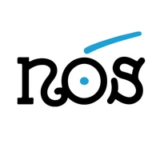

> **This repository is archived. No further updates will be made.**
> This plugin has been superseded by [ovos-stt-plugin-wav2vec](https://github.com/OpenVoiceOS/ovos-stt-plugin-wav2vec2). See the migration guide below.

# OVOS Nos STT

OpenVoiceOS STT plugin for Galician using the [Proxecto Nós](https://github.com/proxectonos) wav2vec2 model.

## Migration Guide

Install the parent plugin:

```bash
pip install ovos-stt-plugin-wav2vec
```

Update your `mycroft.conf`:

```json
"stt": {
    "module": "ovos-stt-plugin-wav2vec",
    "ovos-stt-plugin-wav2vec": {
        "model": "proxectonos/Nos_ASR-wav2vec2-large-xlsr-53-gl-with-lm",
        "lang": "gl"
    }
}
```

This is the exact model this plugin was using internally.

## Credits

This plugin was developed by [TigreGotico](https://tigregotico.pt) for OpenVoiceOS under the [ILENIA](https://proyectoilenia.es) project.


> This plugin was funded by the Ministerio para la Transformación Digital y de la Función Pública and Plan de Recuperación, Transformación y Resiliencia - Funded by EU – NextGenerationEU within the framework of the project [ILENIA](https://proyectoilenia.es) with reference 2022/TL22/00215337



> O [Proxecto Nós](https://github.com/proxectonos) é un proxecto da Xunta de Galicia cuxa execución foi encomendada á Universidade de Santiago de Compostela, a través de dúas entidades punteiras de investigación en intelixencia artificial e tecnoloxías da linguaxe: o ILG (Instituto da Lingua Galega) e o CiTIUS (Centro Singular de Investigación en Tecnoloxías Intelixentes).
